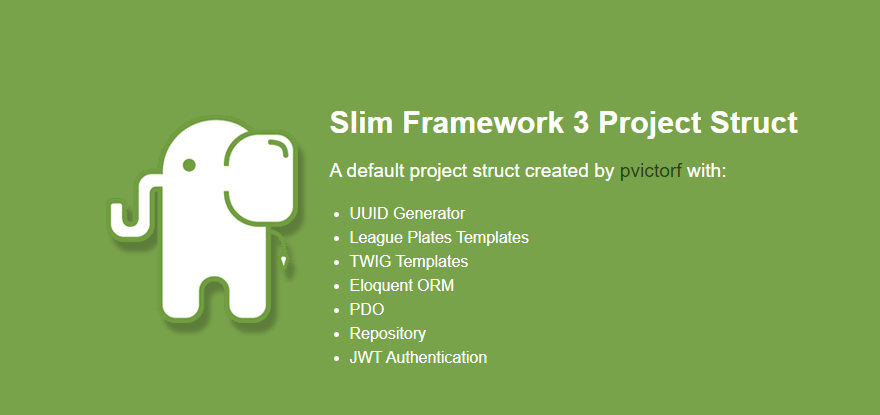

# How to install
  * Run: **composer install and composer dump-autoload -o**
  * Copy **env.example.php to env.php** and set your environment variables.
  * Start server typing:  
    - cd path/to/your/main_project
    - php -S localhost:8888
  * Use insominia or postman to test routes.
  * In **boot/bootstrap.php** configure extensions that you want use.
  
# Models
 * Extends eloquent ORM to connect your database to application (see: https://laravel.com/docs/7.x/eloquent)
  
# Views
 * Native PHP template system (see: https://platesphp.com/)
 
# Controllers
 * They use slim's own Request and Response interfaces (see: http://www.slimframework.com/docs/v3/objects/request.html)
  
# Routes
  * [GET] / - Base url, like: http://localhost:8888/
  * [POST] /signup - To create a new user with token JWT (see: https://github.com/firebase/php-jwt)
  * [POST] /v1/users - Protected routes that need authentication! 
  Use Bearer token with hash received in /signup (see: https://github.com/tuupola/slim-jwt-auth)
  
# Router /signup exemple
  
  
# Router /v1/users exemple using token
  

